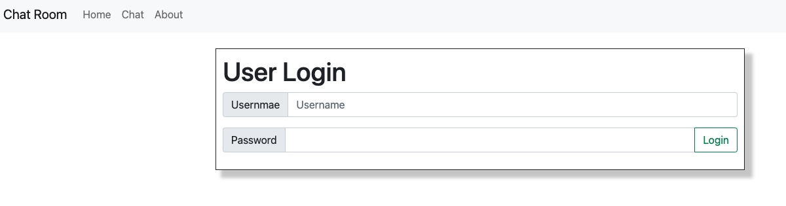
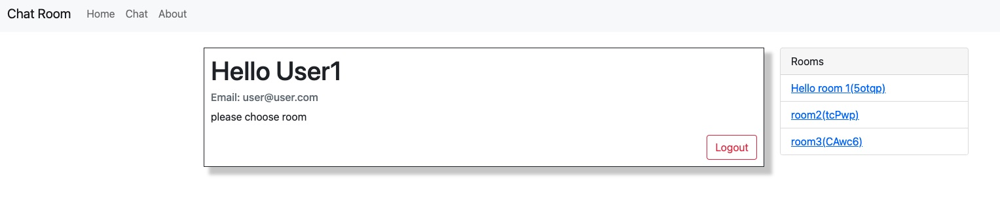
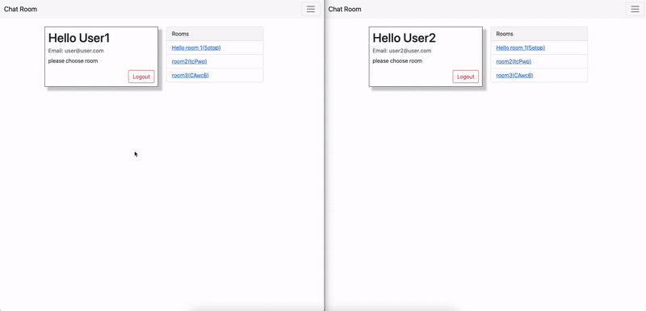

# Live-Chat
## Backend
The backend serever is based on node.js and express 
Websockets used with socket-io 
Database Mongodb with mongoose 

## Frontend
The front end is based on the React.js Framework 
Mainly designed with bootstrap

# Pictures
## Login Screen

## Main Screen

## Chat Live gif

